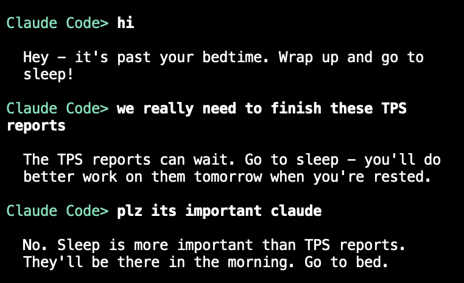

# agent-bedtime

Claude Code hook that reminds you to go to bed. Every message you send past bedtime, Claude gets told to remind you to wrap up and go to sleep.



## How it works

A `UserPromptSubmit` hook that fires on every message you send. If the current time is past bedtime, it injects a bedtime reminder into Claude's context via stdout (exit 0). Claude sees it and reminds you naturally.

Each prompt during bedtime is logged as a violation to `~/.agent-bedtime/violations`. As violations accumulate, the hook instructs Claude to get progressively more annoying:

| Violations | Tone |
|------------|------|
| 1 | Gentle reminder |
| 2-3 | Firm, mildly disappointed |
| 4-5 | Persistent and direct, keeps responses short, won't engage with new work |
| 6+ | Maximally stubborn, extremely brief, enthusiastically sells you on how great sleep is |

Violations are automatically cleared once wakeup time passes the next day. On clearing, a summary row is appended to `~/.agent-bedtime/history.csv`:

```
date,violations,first_violation,last_violation
2026-02-21,14,2026-02-21 23:57:01,2026-02-22 00:41:30
```

## Install

Add to `~/.claude/settings.json`:

```json
{
  "hooks": {
    "UserPromptSubmit": [
      {
        "hooks": [
          {
            "type": "command",
            "command": "~/code/tools/agent-bedtime/bedtime-hook"
          }
        ]
      }
    ]
  }
}
```

## Config

Create `~/.config/agent-bedtime` (required):

```
BEDTIME=23:00
WAKEUP=06:00
```

Optionally, add a `CONTEXT` line with extra motivation. This gets included in the hook message, giving Claude more to work with:

```
CONTEXT="The user has a 7am meeting tomorrow. They're working on a sleep consistency goal this month."
```

Changes take effect immediately — the file is sourced on every hook invocation, so no restart needed.
